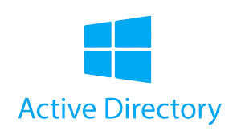
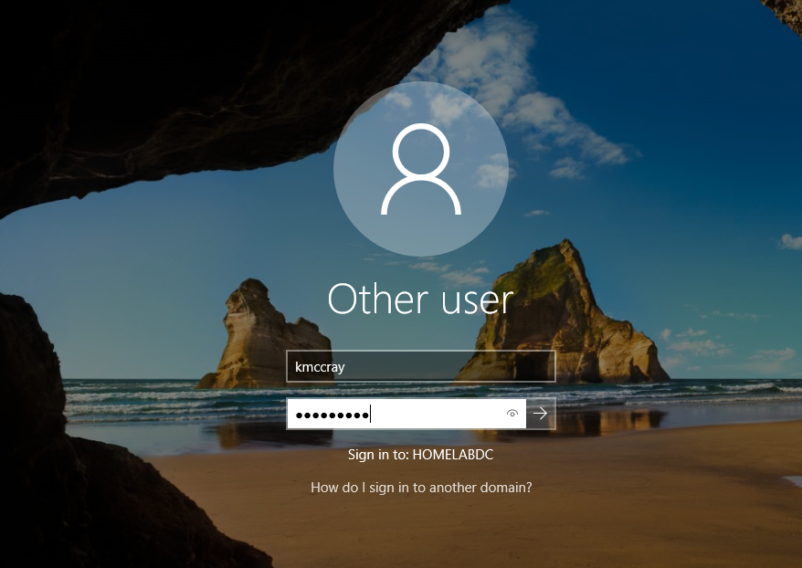
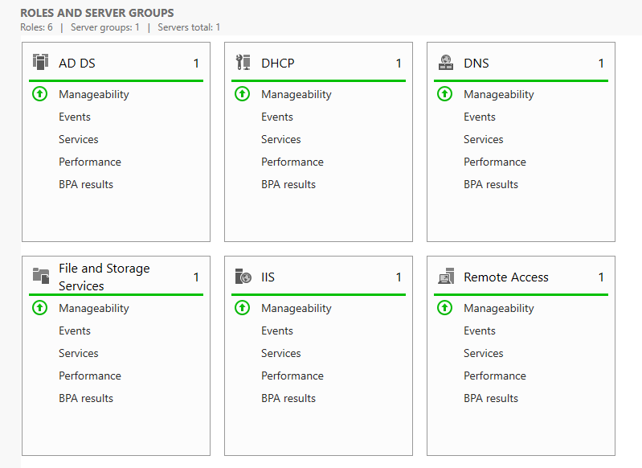

  

# Implementing Active Directory in Windows using VirtualBox

This page describes my virtual Windows Server and the process of installing and configuring various servers.

# Technology Used

- Oracle VirtualBox
- Windows Server 2019
- Windows 10 Pro
- Active Directory Domain Services

# Goals

The primary goals of this homelab are...

- Install and configure Windows Server services
- Create and maintain Active Directory users and groups
- Connect to domain using client PC

# Summary

This homelab uses Windows Server 2019 and Windows 10 Pro on virtual machines to simulate an Active Directory Domain Environment. Using this homelab, I was able to learn how to install and configure an <b>Active Directory server</b>, <b>DHCP server</b>, <b>DNS server</b>, and a <b>Routing and Remote Access server</b>.

My Windows 10 Pro VM was used as a client PC that I could use to connect to the Active Directory Domain and login using a created user in Active Directory.

The DHCP, DNS, and routing servers were all used by the client PC to connect to the internet through an internal network. A second WI-FI adapter on my Windows Server machine acted as a default gateway for the client system and used NAT to route all traffic from the internal network to the outside network.

# VirtualBox Configuration

<table>
  <tr>
    <td></td>
    <td rowspan="3"></td>
  </tr>
  <tr>
    <td></td>
  </tr>
</table>

To get started with this homelab, the first thing I needed to do was configure my Windows Server VM. I gave the VM 4 processing cores, 2GB of RAM, and 20GB of HDD storage. The network adapters also needed to be configured to provide internet access to the client machines.

For this, Adapter 1 was the main internet connection that would be connected through my host machine. Adapter 2 was going to be used as a gateway between my client and server VMs, so it is configured as an internal network to be able to communicate with the other VM.

# Windows Server Setup

<table>
  <tr>
    <td></td>
    <td rowspan="3"></td>
  </tr>
  <tr>
    <td></td>
  </tr>
</table>

The first thing I did when I booted into the system was assign a static IP to my internal network adapter. The adapter is automatically assigned an APIPA address since it cannot connect to a DHCP server. I also changed the name of the system to DC for simplicity.

## Active Directory Installation

  

&nbsp;&nbsp;&nbsp;

Inside of the server dashboard, I used the *Add Roles and Features Wizard* to install the Active Directory Domain Services and added a new forest with the domain name of <b>homelabDC.com</b>.

  
  
  

After restarting the machine, I was now connected to the domain.

With Active Directory installed, the next thing I did was create a domain admin account that I could use to install and configure the rest of the servers.

I first needed to create a new Organizational Unit (OU) to store the new user.

<table>
  <tr>
    <td></td>
    <td rowspan="3"></td>
  </tr>
  <tr>
    <td></td>
  </tr>
</table>

I also created another OU and user that I could use for my client PC.

  

&nbsp;&nbsp;&nbsp;

From the Server Dashboard:

> Tools > Active Directory Users and Computers > right-click homelabDC.com > New > Organizational Unit

  

  

I created a new user inside of the OU and gave the account admin access to the domain. After the account was created, I signed out of the Administrator account and signed into the Domain Admin account.

## Server Installations

  

  

On the Domain Admin account, I used the *Add Roles and Features Wizard* to download and install the <b>DHCP</b>, <b>DNS</b>, and <b>Routing and Remote Access</b> servers.

  
  &nbsp;&nbsp;&nbsp;
  

The first service I set up was the <b>Routing and Remote Access</b> service. This service is used to route traffic between my internal networks and my physical network.

From the Server Dashboard:

> Tools > Routing and Remote Access > right-click DC(local) > Configure and Enable Routing and Remote Access

  
  &nbsp;&nbsp;
  
  &nbsp;&nbsp;
  

The next service for me to set up was the <b>DHCP server</b>. This service was used to assign IP addresses to client PCs. I used the DHCP to define a range of IP addresses to assign to devices along with other configurations like subnet mask, default gateway address, and DNS server address.

From the Server Dashboard:

> Tools > DHCP > dc.homelabdc.com > right click IPv4 > New Scope

# Client PC Setup

  

  

After configuring the DHCP server, all that was left for me to do was connect to the domain using the client PC. To do this, I created a second VM with the same settings as the server VM. The only settings that were changed were the network settings.

Instead of using two adapters, this VM only needed one that was connected to the internal network.

  &nbsp;&nbsp;

The first thing I did on the client PC was open the command prompt and check if the device was getting an IP address from the DHCP server. I also tested pings to verify that I was able to connect to the network.

  

&nbsp;&nbsp;

&nbsp;&nbsp;

Once I was able to connect to the network, the last step was to connect the system to the domain. This can be done in the system settings under:
> Settings > About > Advanced System Settings > Computer Name > Change

  

  

After restarting the system, I was able to sign in with the account username and password that I created earlier. After that, I was done configuring the client PC, and it was successfully connected to the domain.

  

&nbsp;&nbsp;&nbsp;

## Challenges
This was a really fun and interactive homelab that let me test my abilities and become more comfortable navigating a Windows Server. One of the biggest challenges that I repeatedly faced was trying to get the client PC connected to the internet. I was configuring everything, but I was still unable to ping any network outside of the internal network.

I spent lots of time researching and reconfiguring the DHCP and routing servers, but nothing I tried was working. The issue that I was experiencing was related to the network adapter configuration on my client PC, and I needed to reconfigure it to get it working again.

Overall, I think this is a very good project to get started using Active Directory and Windows Server, and I will look to add more services in the future.
